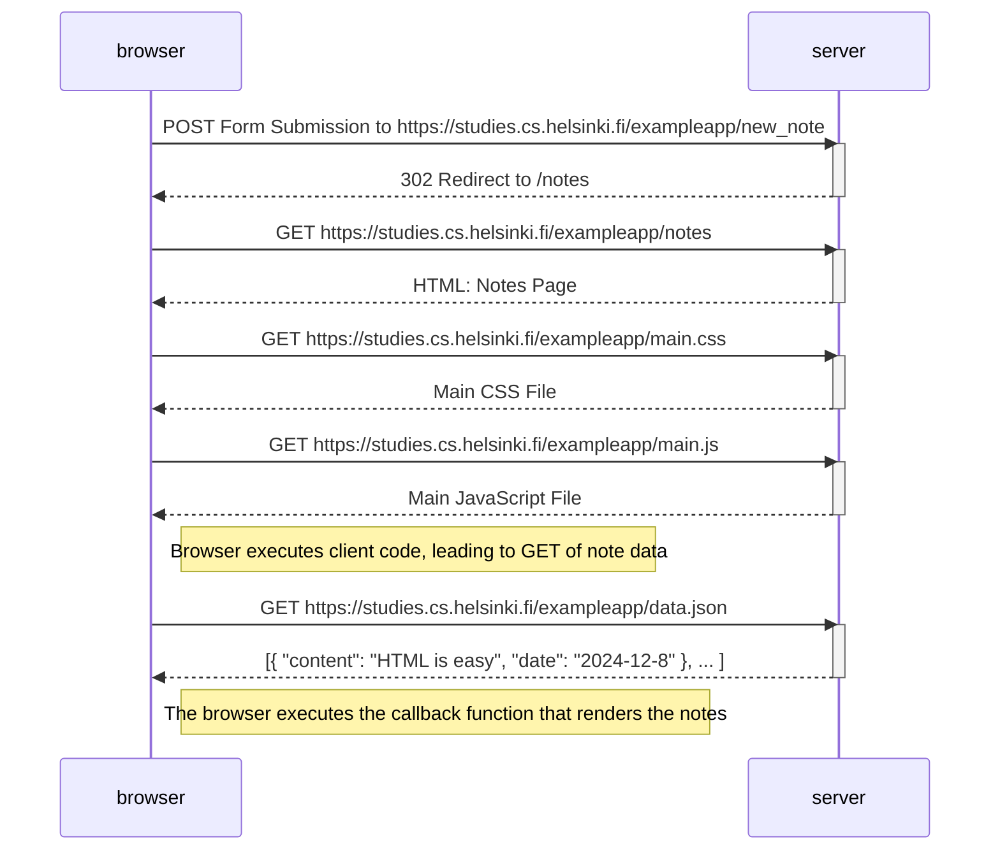
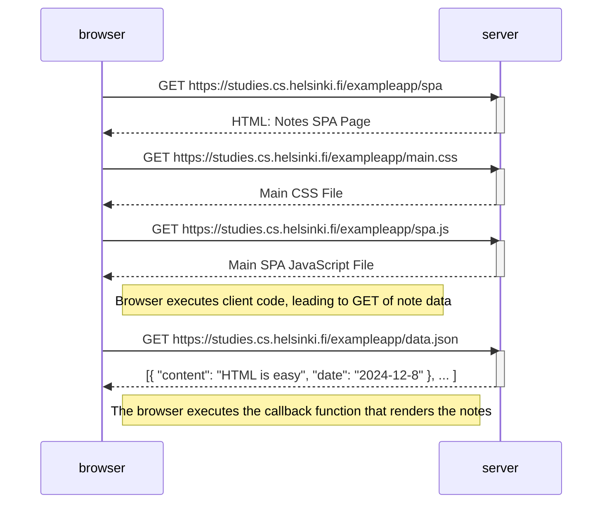
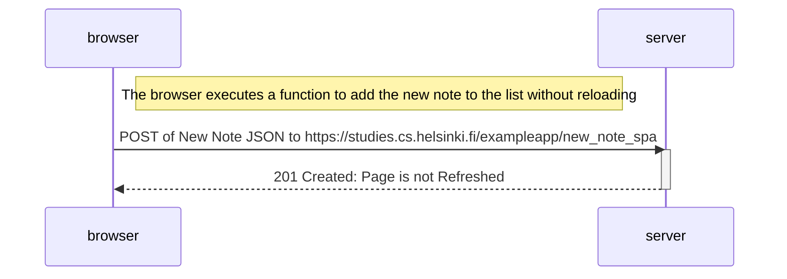

# Exercises 0.4 - 0.6

## 0.4 New Note Diagram

Creating a new note in a traditional web app

## 0.5 Single Page App Diagram

Visiting an SPA-style web app

## 0.6 New Note in Single Page App Diagram

Creating a new note in an SPA-style web app

